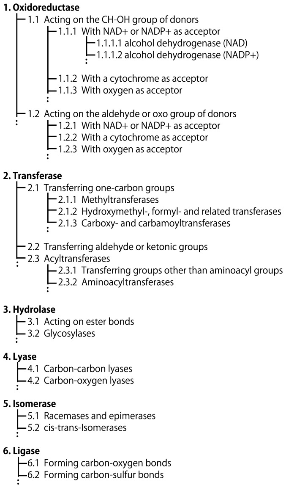
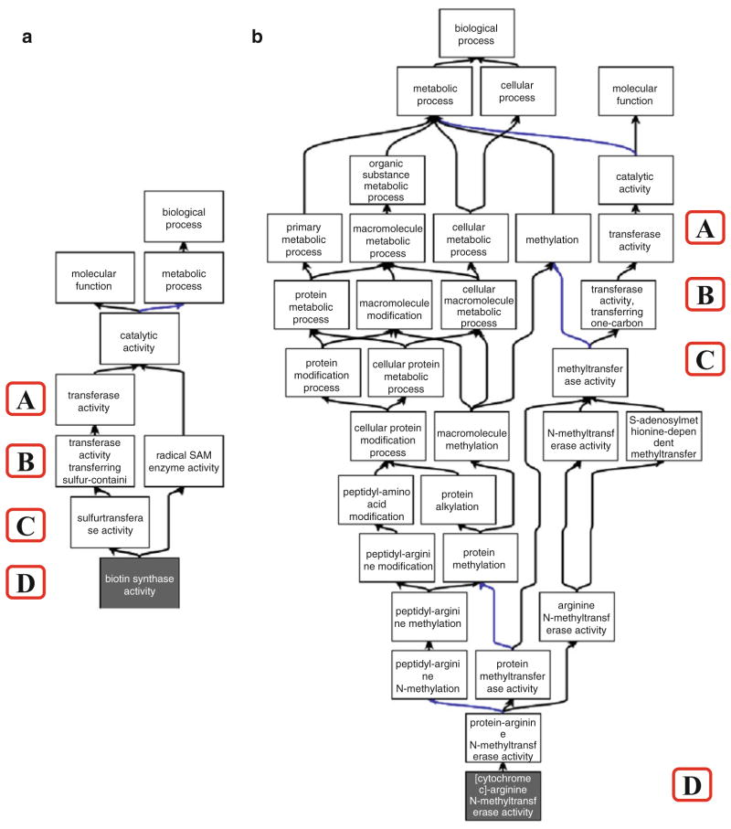
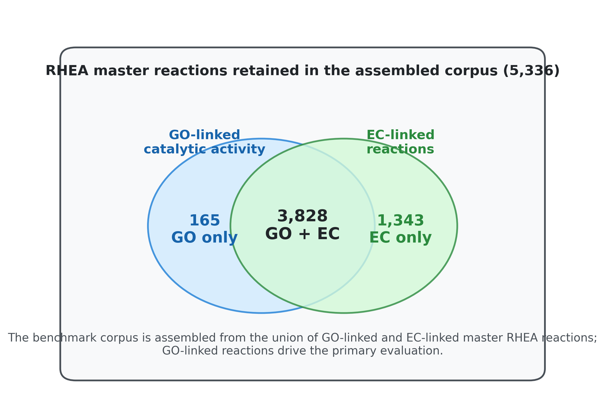
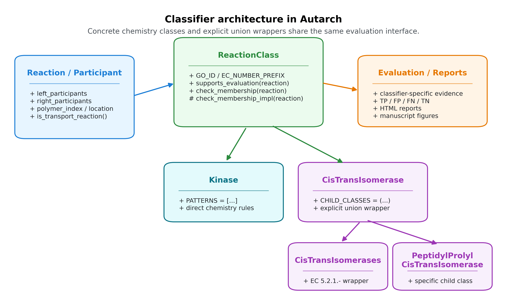
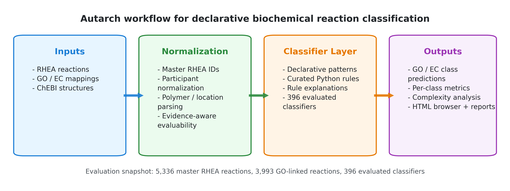
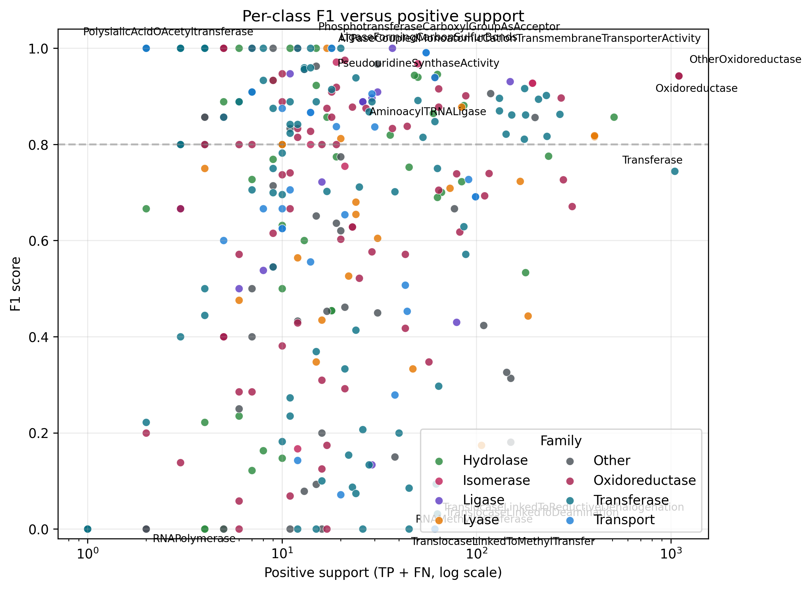
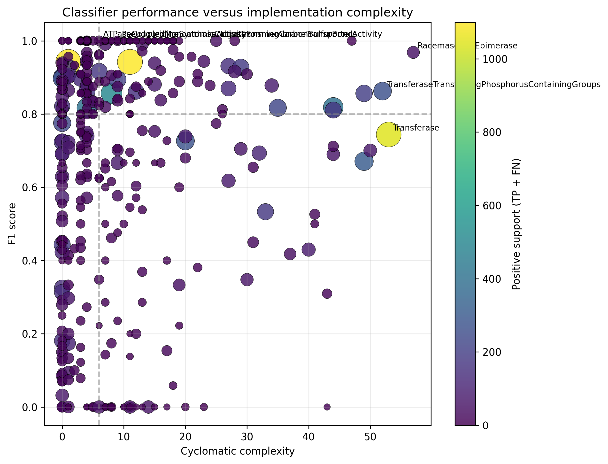
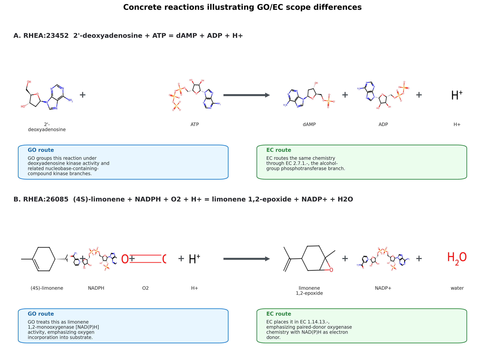

# Autarch: Automated Agentic Reaction Classification Hierarchy

## Abstract

Biochemical reaction classification under GO and EC is central to metabolic reconstruction, enzyme annotation, and comparative functional analysis, yet remains difficult because closely related transformations can differ by cofactors, transport context, or polymer state. We present Autarch (Automated Agentic Reaction Classification Hierarchy), an open-source framework that represents reaction classes as explicit, inspectable pattern-matching programs over reaction participants and transformations. As a methodological companion to C3PO, Autarch extends executable and auditable classifier design from chemical structures to biochemical reactions, while supporting both SMILES-based small-molecule chemistry and polymer reactions represented with relative chain-length notation such as `(n)` and `(n+1)`. In a benchmark over 3,993 GO-linked RHEA reactions from a 2026-03-12 data snapshot, using classifier-specific evidence requirements to determine evaluability, a refreshed 2026-03-22 evaluation run assessed 396 classifiers and achieved micro-precision 0.779, micro-recall 0.720, micro-F1 0.748, and macro-F1 0.666. The resulting gap between pooled and class-balanced performance indicates that declarative reaction classifiers can scale to substantially broader biochemical coverage while still exposing which broad GO concepts remain weakly captured by explicit rule sets.

## Introduction

### The Reaction Classification Problem

Enzymes catalyze a large and chemically diverse space of transformations, and organizing those transformations into functional classes is fundamental to biochemistry. The Enzyme Commission (EC) hierarchy provides a reaction-centric classification scheme developed to standardize enzyme naming around overall catalyzed reactions, while the Gene Ontology (GO) molecular function branch captures enzyme activities in a complementary ontology framework [1,2,4]. Resources such as RHEA connect individual curated reaction equations to both EC and GO, making them a natural substrate for benchmarking reaction classifiers [3].

Despite the maturity of these resources, assigning a reaction equation to the correct functional class remains difficult. Similar bond changes can belong to different functional classes depending on cofactors, acceptors, or transport context; many reactions remain only partially annotated; and a non-trivial subset of biologically important reactions involve polymers or repeating units that are not naturally represented as single small-molecule structures. Modern knowledgebases increasingly separate reaction identity, protein annotation, and pathway context across resources such as Rhea, UniProt, and Reactome, which makes robust cross-resource reaction classification both more feasible and more operationally important [3,5,6].

The two dominant classification systems also differ structurally. EC numbers are designed as a shallow four-level hierarchy, whereas GO molecular function terms are embedded in a richer directed acyclic graph with multiple relation types and varying depths. That difference matters directly for benchmarking: EC is often a useful approximation to reaction chemistry, but GO closure can capture a broader and less tree-like notion of functional relatedness.



**Figure 1.** Historical schematic of the EC numbering hierarchy, reproduced from Kotera and Goto, *Metabolic pathway reconstruction strategies for central metabolism and natural product biosynthesis* (2016), under CC BY. The figure predates the addition of EC class 7 translocases, but remains a useful overview of the four-level EC numbering scheme.



**Figure 2.** Example of GO hierarchy complexity relative to EC assignments, reproduced from Holliday et al., *Evaluating Functional Annotations of Enzymes Using the Gene Ontology* (2017), under CC BY 4.0. This illustrates why GO-based reaction-class benchmarking is not reducible to a simple EC tree.



**Figure 3.** Overlap of GO-linked catalytic activity mappings and EC-linked reactions within the assembled master-RHEA corpus used in this study. The benchmark is constructed from the union of GO-linked and EC-linked master RHEA reactions, with GO-linked reactions defining the primary evaluation set.

### Existing Approaches

Existing approaches span hand-written procedural rule systems, learned models over protein sequences or reaction strings, and ontology-driven inference pipelines. Recent automation work includes transformer-based sequence-to-EC prediction, reaction-first enzyme-function prediction from substrate/product chemistry, and benchmark suites that frame enzyme annotation as a classification or retrieval problem [7-9]. These approaches each address part of the problem, but they also reveal a common trade-off. Procedural rule systems can capture chemically precise distinctions but become difficult to audit and maintain; machine-learning approaches can generalize but often sacrifice interpretability; and ontology-reasoning approaches depend on complete and consistent semantic annotation of participants and reactions.

### Relationship to C3PO

This work is a companion to C3PO (ChEBI Chemical Class Program Ontology) [10], which uses generative AI to synthesize Python programs that classify individual chemical *structures* into ChEBI classes. C3PO demonstrated that declarative, explainable classifiers can be automatically generated using large language models, achieving strong performance while maintaining interpretability.

Autarch adopts the core C3PO methodology: represent classification knowledge as explicit, executable, and explainable programs, then evaluate and refine those programs against curated ontology-linked benchmarks. In Autarch, this methodology is applied to **reaction classification** rather than structure classification, using reaction equations and enzyme-function labels (GO/EC) while preserving the same emphasis on transparency and inspectable rules.

### Our Contribution

Autarch addresses this gap through declarative pattern matching over reactions. Rather than encoding classification logic as opaque procedural heuristics, it represents reaction classes as explicit rules over participants, cofactors, stoichiometry, and bond-change context. The system contributes three main capabilities: a compact DSL for reaction rules, explicit support for polymer reactions and relative chain-length notation, and a benchmark framework grounded in GO-linked and EC-linked RHEA reactions. The software, evaluation workflow, and manuscript artifacts are available from https://github.com/cmungall/autarch.

## Methods

### Data Model

Autarch represents each reaction as ordered left- and right-hand participant lists. Participants may carry ChEBI identifiers, display names, SMILES structures, fixed stoichiometric counts, or symbolic stoichiometry expressions [11,12]. To support reactions beyond the small-molecule setting, participants can also carry polymer-type metadata and relative polymer indices such as `n`, `n+1`, and `n-1`.

A compact small-molecule reaction can be represented directly in YAML. The example below corresponds to a deoxyadenosine kinase reaction and mixes ChEBI identifiers with explicit structure where useful:

```yaml
left_participants:
  - chebi_id: CHEBI:17256
    name: 2'-deoxyadenosine
    smiles: NC1=C2N=CN([C@H]3C[C@H](O)[C@@H](CO)O3)C2=NC=N1
  - chebi_id: CHEBI:30616
    name: ATP(4-)
right_participants:
  - chebi_id: CHEBI:58245
    name: dAMP
  - chebi_id: CHEBI:456216
    name: ADP(3-)
  - chebi_id: CHEBI:15378
    name: hydron
```

Polymer-aware reactions use the same container but add polymer metadata and relative indices:

```yaml
left_participants:
  - name: RNA
    polymer_type: rna
    polymer_index: n
  - chebi_id: CHEBI:16761
    name: CTP
right_participants:
  - name: RNA
    polymer_type: rna
    polymer_index: n+1
  - chebi_id: CHEBI:18361
    name: diphosphate
```

### Pattern Matching DSL

The DSL expresses reaction classes as patterns over participant identities and their transformation context. Rules can specify exact participants such as ATP or water, free variables that bind arbitrary substrates or products, optional cofactors, and forbidden byproducts. A kinase-like rule, for example, can be written declaratively as an ATP-dependent transfer from a substrate state to a product state without hard-coding the full identity of the transferred group recipient.

```python
from autarch.molecules import adp, atp, h_plus, p
from autarch.pattern_dsl import optional, var

KINASE_PATTERNS = [
    p(atp) + var("substrate") + optional(p(h_plus))
    >> p(adp) + var("product") + optional(p(h_plus)),
]
```

The classifier then evaluates these patterns against a concrete reaction using strict participant accounting. This keeps the common cases short and declarative while still allowing additional chemistry checks when needed.

### Polymer Reaction Support

Polymer reactions are represented explicitly rather than being forced into lossy small-molecule surrogates. Expressions such as `RNA(n) + NTP -> RNA(n+1) + PPi` capture directionality of growth or degradation while preserving the fact that the reactive substrate is a polymeric entity. This notation enables direct treatment of polymerases, nucleases, and polymer-modifying enzymes within the same framework used for small-molecule chemistry.

### Classifier Architecture

Each classifier inherits from a common `ReactionClass` interface and returns both a boolean classification and an explanation. Classifiers may be fully declarative, hybrid declarative/procedural, or procedural when chemically necessary, but all are evaluated through the same interface and produce explicit rationales that support debugging, curation, and downstream error analysis.

Two architectural patterns dominate in practice. The first is a direct chemistry classifier such as `Kinase`, which declares a small pattern set and a small number of guard conditions. The second is an explicit ontology wrapper such as `CisTransIsomerase`, which is defined as a union of curated child classifiers rather than by re-reading GO or EC annotations from the benchmark. Figure 4 summarizes these relationships.



**Figure 4.** UML-like overview of the classifier architecture. Concrete chemistry classes inherit from a shared `ReactionClass` interface, while higher-level ontology wrappers are expressed as explicit unions of curated child classifiers rather than as proxy lookups against GO or EC annotations.

### Classifier Complexity Analysis

We quantified implementation complexity for each ontology classifier module using static source analysis. For each module, we measured total lines of code, source lines of code, the length of `check_membership_impl()`, cyclomatic complexity of `check_membership_impl()` (via `radon`), counts of conditional branches and explicit exclusion rules, the number of declared pattern templates, and the number of referenced ChEBI identifiers. These measurements were summarized across classifier modules and compared with per-class evaluation performance to assess whether higher implementation complexity was associated with improved benchmark accuracy.

### RHEA Dataset Assembly

We assembled the reaction corpus from RHEA release files distributed via ExPASy FTP, integrating reaction structures, directional-equivalence mappings, EC cross-references, participant naming resources, and curated textual reaction equations. GO molecular function mappings were imported from the GO cache and attached to reactions through RHEA cross-references.

To prevent directional duplication during evaluation, reactions were consolidated to direction-neutral master RHEA identifiers using the curated RHEA direction mapping table rather than arithmetic ID heuristics. Candidate reactions were retained when linked to EC terms, GO terms, or both.

In the benchmark snapshot used in this manuscript (2026-03-12), this process yielded 5,336 master reactions, including 5,171 with EC mappings and 3,993 with GO mappings (3,828 with both; 1,343 EC-only; 165 GO-only). Participants were normalized by combining structure-derived participants with curated ChEBI identifiers from reaction equations, with constrained name-based fallback only for unresolved entities. Polymer stoichiometry and compartment qualifiers from curated equations were propagated to participant metadata (402 polymer-annotated reactions; 120 location-annotated reactions). Among the 3,993 GO-linked reactions, 3,484 have complete participant structure coverage. The remainder are still informative for classes whose rules depend only on participant identifiers or polymer metadata, rather than full small-molecule structure.

### Ground Truth and Evaluation

Evaluation uses RHEA as the ground-truth reference resource linking reaction chemistry to EC and GO molecular function annotations. In the default configuration (`go_only=True`), only GO-annotated reactions are considered for class labeling. For a given classifier GO term, a reaction is labeled positive when any mapped GO term is identical to the target term or a descendant of the target in the GO hierarchy; annotated reactions not satisfying this criterion are labeled negative. Reactions lacking GO/EC annotation are tracked but excluded from core metric computation. To avoid imposing a global structure-completeness filter on classes whose rules are identifier- or polymer-based, each classifier declares the minimum evidence required for evaluation, currently drawn from complete SMILES coverage, polymer metadata, or participant identifiers. Reactions that do not satisfy the evidence requirements of the classifier under test are excluded for that class, so evaluable denominators vary across the benchmark while classifier logic itself remains unchanged.

Performance is reported per class and in aggregate using precision, recall, F1 score, and Matthews correlation coefficient (MCC). Precision, recall, and F1 are computed from TP/FP/FN counts in the standard way, and MCC is reported to provide a class-imbalance-aware summary. An EC-based labeling mode (`go_only=False`) remains available as a secondary analysis path, using exact EC lists or EC-prefix matching when classifier EC metadata is provided.

### Independent GO/EC Divergence Analysis

Because discrepancies between GO-linked and EC-linked reaction sets can reflect ontology and curation differences rather than classifier behavior, we computed an independent benchmark-divergence analysis for each class. For every classifier carrying GO and/or EC metadata, we constructed the set of positive RHEA reactions implied by GO closure and the set implied by EC mapping, then summarized their overlap using intersection size, GO-only and EC-only tails, and Jaccard similarity. This analysis was used to distinguish classes for which GO and EC define nearly identical benchmark positives from classes where a naive merged benchmark would confound classifier error with disagreement between annotation systems.



**Figure 5.** Dataset assembly and evaluation workflow. Curated RHEA reactions, GO/EC mappings, and ChEBI structures are normalized into a master-reaction corpus with polymer-aware participant metadata, then evaluated against a library of direct chemistry classifiers and explicit child-union wrappers.

## Results

### Overview

In the current evaluation run (2026-03-22) over the fixed 2026-03-12 RHEA/GO data snapshot, Autarch evaluated 396 classifiers against a GO-linked benchmark containing 3,993 reactions. Under the evidence-aware evaluation regime, structure-dependent classes were evaluated on the 3,484 reactions with complete participant structure coverage, whereas identifier- and polymer-driven classes could use a larger subset of the GO-linked corpus; the resulting per-class denominators ranged from 3,484 to 3,993 reactions. After expanding the public classifier inventory to include additional GO-backed concepts and explicit EC wrapper classes, aggregate performance remained stronger at the pooled prediction level (micro-F1 0.748) than at the class-balanced level (macro-F1 0.666), indicating that performance remained uneven across the enlarged class set.

| Aggregate Metric | Value |
|------------------|-------|
| Macro Precision | 0.726 |
| Macro Recall | 0.700 |
| Macro F1 | 0.666 |
| Micro Precision | 0.779 |
| Micro Recall | 0.720 |
| Micro F1 | 0.748 |

### Performance Distribution

Per-class performance remained heterogeneous, with a substantial long tail despite improved overall coverage:

| Per-class F1 band | Number of classes |
|-------------------|-------------------|
| F1 >= 0.90 | 133 |
| 0.70 <= F1 < 0.90 | 104 |
| 0.30 <= F1 < 0.70 | 79 |
| F1 < 0.30 | 80 |
| F1 = 0.00 | 39 |

The median per-class F1 was 0.800. Twenty-one classes had zero positive support in this benchmark split, and 59 classes had support of one reaction or less. Accordingly, the distribution should be interpreted as a mixture of well-supported broad classes, moderately supported specific activities, and a substantial low-support regime in which per-class estimates are unstable.

Figure 6 makes this support effect explicit: a substantial fraction of perfect or near-perfect classes are supported by few positive reactions, whereas the high-support region is dominated by broader parent classes whose ontology boundaries are intrinsically more difficult to capture with a single rule set. This support imbalance is the main driver of the gap between micro-averaged and macro-averaged performance.



**Figure 6.** Per-class F1 versus positive support (`TP + FN`). Broad high-support parent classes occupy much of the right-hand side of the plot, while many perfect or near-perfect classifiers occur in the low-support regime.

### High-Performing Classifiers

One hundred thirty-three classifiers achieved F1 >= 0.90 in the current benchmark. However, many of these classes had only one or two positives. The more informative pattern is that a subset of classifiers remained strong under non-trivial support, including broad parent classes such as `Oxidoreductase`, `Ligase`, `Isomerase`, and `Kinase`, together with transport-linked and mid-level mechanistic classes such as `PrimaryActiveTransmembraneTransporter`, `TranslocaseLinkedToHydrolysis`, and `Pyrophosphatase`.

| Classifier | Positive support | Precision | Recall | F1 |
|-----------|------------------|-----------|--------|-----|
| TranslocaseLinkedToHydrolysis | 54 | 0.982 | 1.000 | 0.991 |
| PrimaryActiveTransmembraneTransporter | 60 | 0.982 | 0.900 | 0.939 |
| Pyrophosphatase | 47 | 1.000 | 0.894 | 0.944 |
| CarboxylicEsterHydrolase | 62 | 0.910 | 0.984 | 0.946 |
| RacemaseAndEpimerase | 49 | 1.000 | 0.939 | 0.968 |
| Sulfotransferase | 17 | 1.000 | 1.000 | 1.000 |
| ThiolesterHydrolase | 14 | 1.000 | 1.000 | 1.000 |
| IntramolecularPhosphotransferase | 11 | 1.000 | 1.000 | 1.000 |
| Peroxidase | 12 | 1.000 | 0.917 | 0.957 |
| Oxidoreductase | 1099 | 0.955 | 0.930 | 0.942 |
| Ligase | 148 | 0.904 | 0.959 | 0.931 |
| Isomerase | 193 | 0.927 | 0.927 | 0.927 |
| Kinase | 176 | 0.962 | 0.875 | 0.917 |

### Polymer Reaction Support

Autarch includes dedicated polymer-aware classifiers and pattern logic for reactions with `(n)`-style stoichiometry. Polymer-capable classification is clearly feasible, but class-specific estimates remain unstable because only a few polymer-focused terms have more than minimal support:

| Classifier | Positive support (TP+FN) | Precision | Recall | F1 |
|-----------|---------------------------|-----------|--------|-----|
| AminoacylTRNALigase | 25 | 1.000 | 0.800 | 0.889 |
| RNAPolymerase | 1 | 0.000 | 0.000 | 0.000 |
| Pectinesterase | 1 | 1.000 | 1.000 | 1.000 |
| PolysialicAcidOAcetyltransferase | 1 | 1.000 | 1.000 | 1.000 |

The contrast between `AminoacylTRNALigase` and the one-example polymer classes illustrates the current regime. The framework can represent and classify polymer chemistry, and some polymer-linked singletons now score perfectly under identifier-aware evaluation, but benchmark coverage remains too sparse to support strong general claims about polymer-class performance as a whole.

### Error Analysis

Errors were concentrated in broad grouping classes rather than narrow specific activities. The highest false-positive burdens were observed for `OxidoreductaseActingOnCHOHGroupOfDonors` (194), `AlcoholDehydrogenaseNADP` (161), `OxidoreductaseActingOnTheCHOHGroupOfDonorsNADOrNADPAsAcceptor` (159), `GlycerophospholipaseActivity` (110), and `PhospholipaseActivity` (109). The largest false-negative burdens were observed for `Transferase` (412), `CatalyticActivityActingOnAProtein` (132), `CarbonOxygenLyase` (128), `CatalyticActivityActingOnANucleicAcid` (120), and `CatalyticActivityActingOnRNA` (113). Concretely, the system often recognizes the chemistry but must choose between overlapping parent interpretations: deoxynucleoside kinase reactions are chemically alcohol-group phosphotransferases yet are grouped by GO under nucleobase-containing-compound kinase branches, while limonene and sterol oxygenations can be grouped either under transformation-centric monooxygenase umbrellas or under donor-specific EC `1.14.*` oxygenase branches.

### Code Metrics

Static analysis of the ontology source tree identified 502 classifier-related modules, 396 of which participated in the current GO benchmark. Across the evaluated set, median module size was 69.0 lines of code (IQR 35.0-141.0), and the median `check_membership_impl()` length was 24.0 lines (IQR 8.0-48.0). Median cyclomatic complexity was 6.0 (IQR 3.0-12.2; mean 9.4). The most complex modules were `racemase_and_epimerase` (CC 57), `transferase` (53), `transferase_transferring_phosphorus_containing_groups` (52), `phosphatase` (50), and `oxidoreductase_acting_on_choh_group_of_donors` (49). Across the 396 evaluated classes, implementation complexity showed a weak positive association with F1 score (Spearman rho = 0.162), indicating that added code volume alone neither guarantees nor precludes good benchmark performance.

Figure 7 reinforces this point. High-support broad classes tend to occupy the moderate-to-high complexity range, but increased implementation complexity alone does not guarantee higher F1. The scatter is more consistent with targeted chemical alignment than with a simple “more code yields better performance” relationship.



**Figure 7.** Classifier performance versus implementation complexity. Point color indicates positive support and point size scales with the number of positive benchmark reactions.

## Discussion

### Advantages of Declarative Classification

The main practical advantage of Autarch is not simply that it is rule-based, but that its rules remain inspectable at the level of biochemically meaningful distinctions. This matters because many of the observed errors occur in broad parent classes or at ontology boundaries, where the relevant distinction is often a specific cofactor dependency, donor-acceptor regime, byproduct pattern, or transport context rather than an opaque latent feature. In this setting, explicit classifier logic supports targeted error analysis and iterative curation in a way that is difficult to achieve with purely procedural or black-box models.

### GO/EC Divergence Reveals Competing Biochemical Abstractions

One of the clearest scientific results of this study is that GO and EC do not merely provide redundant labels for the same reaction-class space. Across 488 classes with GO and/or EC metadata, only 53 showed exact GO-EC agreement, whereas 61 showed GO-derived sets that were proper subsets of EC-derived sets, 13 showed the inverse relation, and 109 were genuinely divergent. These disagreements are not concentrated in arbitrary corners of the ontology; they recur in families where multiple biochemical abstraction axes are plausible.

The kinase branch provides a compact example. `Kinase` remained a strong classifier in the GO benchmark (precision 0.963, recall 0.875, F1 0.917), but its GO- and EC-derived positive sets still diverged substantially (`GO=195`, `EC=392`, intersection `=192`, Jaccard `=0.486`). Reaction-level review showed that this is not primarily because the classifier is wrong, but because EC classifies many reactions by acceptor chemistry, whereas GO often groups them by substrate family. Deoxynucleoside kinases illustrate the point clearly: chemically they are alcohol-group phosphotransferases, but GO routes them through nucleobase-containing-compound kinase branches rather than through the alcohol-group phosphotransferase hierarchy.

Oxygenase classes show a different but equally informative split. GO monooxygenase terms emphasize the transformation pattern in which one oxygen atom is incorporated into substrate and the other is reduced to water, whereas EC `1.14.14.*` subclasses emphasize paired-donor electron-transfer architecture. This is visible both in reaction-level conflicts such as limonene and sterol hydroxylations and in class-level divergence patterns. `Monooxygenase` itself behaves as a broad GO umbrella with no exact EC counterpart in the current benchmark, while narrower paired-donor oxygenase classes align more closely with EC. The result is a recurring tension between transformation-centric and cofactor-centric classification.



**Figure 8.** Concrete reaction-level examples of GO/EC scope divergence. Panel A shows a deoxyadenosine kinase reaction that GO groups with nucleobase-containing-compound kinases while EC routes the same chemistry through alcohol-group phosphotransferases. Panel B shows limonene 1,2-monooxygenase chemistry, where GO foregrounds oxygen incorporation into substrate while EC foregrounds the paired-donor electron-transfer regime.

Transferase families show the same phenomenon at larger scale. `UDPGlycosyltransferaseActivity` has `GO=130`, `EC=331`, and overlap `=126`, whereas `UDPGlucosyltransferaseActivity` has `GO=52`, `EC=253`, and overlap `=50`; `AcetylglucosaminyltransferaseActivity` is even more extreme (`GO=28`, `EC=253`, overlap `=27`). These are not random mismatches. GO terms are often substrate-specific and biologically contextual, while EC branches describe broader donor-transfer chemistry. The same pattern appears in steroid dehydrogenases: `SteroidDehydrogenaseActivityActingOnTheCHOHGroupOfDonorsNADOrNADPAsAcceptor` has only `30` GO-linked positives but `413` EC-linked positives, with an overlap of `29`, indicating that the GO term is a narrow steroid-focused slice of a much broader NAD(P)-dependent dehydrogenase chemistry space.

These cases suggest that GO/EC divergence should itself be treated as a biochemical result. When the two resources disagree systematically, the disagreement often reflects competing but defensible views of function: substrate class versus donor/acceptor chemistry, biological role versus reaction mechanism, or narrow mechanistic specialization versus broad family membership. Raw GO+EC benchmark merging therefore risks conflating ontology disagreement with classifier error.

### Broad Parent Classes Are Intrinsically Heterogeneous

The current benchmark also clarifies which parent concepts are chemically coherent enough to support explicit rule-based classification and which are not. Some broad classes remain tractable: `Hydrolase` achieves F1 `0.857`, and `Kinase` achieves F1 `0.917`, indicating that despite internal diversity these families still preserve a sufficiently strong shared reaction signature. By contrast, broader umbrellas such as `Transferase` (F1 `0.744`) already show the cost of combining many mechanistic subclasses into one label.

The most revealing examples are the very broad GO parent concepts. `CatalyticActivityActingOnAProtein` reaches only F1 `0.181`, while `CatalyticActivityActingOnANucleicAcid` and `CatalyticActivityActingOnRNA` reach F1 `0.314` and `0.326`, respectively. These are not simply poorly engineered classifiers. Rather, they bundle together chemically heterogeneous activities for which “acting on a protein” or “acting on RNA” is a substrate-domain statement, not a single reaction-mechanistic statement. The weak performance of these classes therefore argues that some parent terms are intrinsically unsuitable as chemistry-first reaction classes, at least without a richer ontological decomposition.

### Handling Polymer Reactions

Explicit polymer notation extends the framework beyond atom-mapped small molecules and allows polymer length change to be treated as a first-class feature of the reaction representation. This is sufficient to capture nucleic-acid polymerization and degradation, polymer-modifying transferases, and other reactions for which the decisive signal is the relation between `n` and `n+1` rather than a conventional small-molecule bond change. Importantly, this is already more than a purely formal capability: `AminoacylTRNALigase`, a polymer-linked class with support `25`, achieved precision `1.000`, recall `0.800`, and F1 `0.889`. The main current limitation is therefore not that polymer reactions are inexpressible, but that polymer-focused gold-standard coverage remains sparse for most other classes. The present conclusion is representational but still substantive: polymer state can function as a first-class reaction-class signal within the same framework used for small-molecule chemistry.

### Limitations

The current results also make the main limitations clear. The gap between micro-F1 (0.748) and macro-F1 (0.666) shows that expanding class coverage has not yet translated into uniform per-class quality. Broad parent classes continue to accumulate both false positives and false negatives, while many narrow classes remain difficult to assess because support is extremely sparse; in the present benchmark, 21 classes have zero positive support and 59 have support of one reaction or less. In addition, evidence-aware evaluation introduces class-specific denominators: this is methodologically preferable to a single global filter, but it means that class-to-class comparisons must still be interpreted in light of differing evidence availability. Rule development also still depends on expert curation, particularly where neighboring GO or EC classes differ by subtle mechanistic context. Finally, benchmark quality is constrained by the completeness and consistency of RHEA-to-GO mappings and by representational gaps for polymers, locations, and incompletely specified participants.

The supplementary GO/EC divergence analysis makes this last point more concrete. Large mismatches were concentrated in broad parent classes and residual catch-all categories such as `OtherOxidoreductase`, `OtherLyase`, `Monooxygenase`, `Kinase`, and `Transferase`, where raw GO+EC merging would mix ontology disagreement with classifier error. Conversely, a number of narrower mechanistic classes were close to coterminous across the two resources, indicating that merged or EC-augmented benchmarking is most defensible when class-level alignment has first been checked explicitly.

Manual review of high-confidence reaction-level disagreements identified four recurring causes. First, there are genuinely unannotated candidates: reactions with neither GO nor EC support that Autarch nonetheless classifies, which are the strongest cases for potential new curation. Second, some reactions are absent from the GO-labeled benchmark despite already carrying specific EC assignments, as in `RHEA:12192` (`(2E,6E)-farnesyl diphosphate + H2O = germacradien-6-ol + diphosphate`), which is already classified in EC as terpene synthase `4.2.3.166` and therefore represents a GO-coverage gap rather than an unclassified reaction. Third, some benchmark errors originate in local materialization rather than in GO itself: for example, aminoacyl-tRNA deacylase terms such as `GO:0106105` and `GO:0106026` are descendants of hydrolase / carboxylic-ester-hydrolase activity in GO, but those ancestors were absent from an earlier cached closure used for evaluation; we subsequently added explicit cache validation and regenerated the GO cache to eliminate this failure mode. Fourth, a number of apparent false positives reflect genuine GO/EC scope differences rather than reaction misannotation, including CoA-ligase activities versus the narrower acid-thiol-ligase grouping, nucleoside kinases versus alcohol-group phosphotransferases, and cytochrome P450 monooxygenases versus EC `1.14.14.*` subclasses. We therefore maintain a curated benchmark-disagreement catalog that distinguishes true unannotated candidates from benchmark-coverage gaps, local bugs, and true classification conflicts (Supplementary Table S5).

### Future Work

Three near-term directions follow from these results. First, automated rule induction and refinement should be pursued under an explicit parsimony objective, so that gains in F1 are balanced against unnecessary classifier complexity and overfitting. Second, richer ontological generalization is needed, particularly through ChEBI-informed abstractions and more principled treatment of broad parent classes, transport processes, and polymer contexts. Third, broader benchmark release and external validation will be important, including archived large-scale evaluation outputs and cross-database comparison against additional curated reaction resources.

## Conclusion

Autarch shows that biochemical reaction classification can be framed as a collection of explicit, executable, and inspectable rules over reaction structure and context. On a 396-class evaluation over 3,993 GO-linked RHEA reactions with classifier-specific evidence requirements, the framework achieved micro-F1 of 0.748 and macro-F1 of 0.666 while preserving interpretability and support for polymer reactions. These results support declarative reaction classification as a practical complement to learned and ontology-driven approaches, particularly when auditability and targeted curation are required.

## Data Availability

Source code and documentation are available at https://github.com/cmungall/autarch and https://cmungall.github.io/autarch. The evaluation workflow is fully reproducible from the repository. Large per-reaction evaluation tables generated for this manuscript are not versioned in git and will be archived separately alongside the release snapshot.

## Acknowledgments

We thank the maintainers and contributors of RHEA, ChEBI, Gene Ontology, RDKit, and the C3PO project for foundational infrastructure and open resources.

## References

1. Tipton KF, Boyce S. History of the enzyme nomenclature system. Bioinformatics. 2000;16(1):34-40. doi:10.1093/bioinformatics/16.1.34

2. McDonald AG, Tipton KF. Fifty-five years of enzyme classification: advances and difficulties. FEBS J. 2014;281(2):583-592. doi:10.1111/febs.12530

3. Bansal P, Morgat A, Axelsen KB, et al. Rhea, the reaction knowledgebase in 2022. Nucleic Acids Res. 2022;50(D1):D693-D700. doi:10.1093/nar/gkab1016

4. Gene Ontology Consortium. The Gene Ontology resource: enriching a GOld mine. Nucleic Acids Res. 2021;49(D1):D325-D334. doi:10.1093/nar/gkaa1113

5. Bateman A, Martin MJ, Orchard S, et al. UniProt: the universal protein knowledgebase in 2023. Nucleic Acids Res. 2023;51(D1):D523-D531. doi:10.1093/nar/gkac1052

6. Milacic M, Beavers D, Conley P, et al. The Reactome pathway knowledgebase 2024. Nucleic Acids Res. 2024;52(D1):D672-D678. doi:10.1093/nar/gkad1025

7. Kim GB, Kim JY, Lee JA, et al. Functional annotation of enzyme-encoding genes using deep learning with transformer layers. Nat Commun. 2023;14:7804. doi:10.1038/s41467-023-43216-z

8. Qian W, Wang X, Kang Y, et al. A general model for predicting enzyme functions based on enzymatic reactions. J Cheminform. 2024;16:27. doi:10.1186/s13321-024-00827-y

9. Hua C, Zhong B, Luan S, et al. ReactZyme: a benchmark for enzyme-reaction prediction. arXiv. 2024. doi:10.48550/arXiv.2408.13659

10. Mungall CJ, Malik A, Korn DR, Reese JT, O'Boyle NM, Hastings J. Chemical classification program synthesis using generative artificial intelligence. J Cheminform. 2025;17:152. doi:10.1186/s13321-025-01092-3

11. Hastings J, Owen G, Dekker A, et al. ChEBI in 2016: improved services and an expanding collection of metabolites. Nucleic Acids Res. 2016;44(D1):D1214-D1219. doi:10.1093/nar/gkv1031

12. Weininger D. SMILES, a chemical language and information system. 1. Introduction to methodology and encoding rules. J Chem Inf Comput Sci. 1988;28(1):31-36. doi:10.1021/ci00057a005

## Supplementary Materials

### S1: Complete Classifier List

The complete classifier inventory is available from the generated HTML report and repository source tree.

### S2: Pattern DSL Reference

The DSL specification is provided in the project documentation and source distribution.

### S3: Evaluation Protocol

The evaluation protocol is defined in the source code and reproduced by the released benchmark workflow.

### S4: GO/EC Benchmark Divergence

Supplementary benchmark-divergence tables summarize, for each class, the overlap between GO-derived and EC-derived positive RHEA sets independently of classifier predictions. These tables are released with the evaluation artifacts as `benchmark_divergence.csv` and `benchmark_divergence_summary.txt`.

### S5: Reaction-Level Benchmark Disagreement Catalog

A curated catalog of high-confidence reaction-level benchmark disagreements, intended for GO/RHEA/EC issue filing, is released as `benchmark_disagreement_catalog.tsv` and rendered in `benchmark_disagreement_catalog.md`.

For readers, the important distinction is between four situations: `(i)` truly unannotated candidate reactions with neither GO nor EC support; `(ii)` GO-coverage gaps, where a reaction already has EC support but is absent from the GO-labeled benchmark; `(iii)` local benchmark bugs such as stale or incomplete ancestor closure; and `(iv)` true GO/EC scope conflicts, where the reaction is classified but the ontology boundaries disagree with the mechanistic grouping used by the classifier.

Representative cases are shown below to make those categories concrete:

| RHEA | Reaction summary | Category | Why it matters |
| --- | --- | --- | --- |
| `RHEA:12192` | `(2E,6E)-farnesyl diphosphate + H2O = germacradien-6-ol + diphosphate` | GO-coverage gap | The reaction already has the specific EC assignment `4.2.3.166` (terpene synthase), so it is not an unclassified reaction; the issue is that it is absent from the GO-labeled benchmark. |
| `RHEA:17793` | `L-alanyl-tRNA(Thr) + H2O = L-alanine + tRNA(Thr)` | Local benchmark bug | The GO term is a descendant of hydrolase / carboxylic-ester-hydrolase in GO itself, but an earlier cached ancestor closure omitted those parents. |
| `RHEA:12140` | `deoxynucleoside + ATP = deoxynucleoside phosphate + ADP` | True GO/EC scope conflict | EC treats nucleoside kinases as alcohol-group phosphotransferases, whereas GO routes them under kinase / nucleobase-containing-compound-kinase branches. |

### S6: Representative Code Examples

This appendix includes short excerpts from the current codebase to make the implementation style concrete. These are real examples adapted from the repository, lightly shortened for readability.

#### S6.1 SMARTS-based moiety patterns

The system uses explicit SMARTS patterns for common functional groups. These patterns are then reused across many classifiers through `participant.has_moiety(...)`.

```python
class Moiety(Enum):
    PHOSPHATE = "[P;X4](=[O;X1])([O;X2])([O;X2])[O;X2]"
    THIOESTER = "[C;X3](=[O;X1])[S;X2]"
    CARBOXYL = "[C;X3](=[O;X1])[O;H1,X1-]"
    ALDEHYDE = "[CX3H1,H2](=O)"
    KETONE = "[#6][CX3](=O)[#6]"
```

These SMARTS are intentionally simple: they are meant to capture reusable biochemical moieties rather than solve full reaction classification on their own.

#### S6.2 Base classifier interface and evidence declaration

The core abstraction is a `ReactionClass` with an explicit evaluation-evidence contract. This allows benchmark eligibility to remain declarative rather than being hard-coded in the evaluator.

```python
class EvaluationEvidence(str, Enum):
    COMPLETE_SMILES = "complete_smiles"
    POLYMER_METADATA = "polymer_metadata"
    PARTICIPANT_IDENTIFIERS = "participant_identifiers"


class ReactionClass(ABC):
    GO_ID: ClassVar[Optional[str]] = None
    EC_NUMBER_PREFIX: ClassVar[Optional[str]] = None
    EVALUATION_EVIDENCE: ClassVar[frozenset[EvaluationEvidence]] = frozenset(
        {
            EvaluationEvidence.COMPLETE_SMILES,
            EvaluationEvidence.POLYMER_METADATA,
        }
    )

    @classmethod
    def supports_evaluation(cls, reaction: Reaction) -> bool:
        participants = reaction.all_participants()

        if (
            EvaluationEvidence.COMPLETE_SMILES in cls.EVALUATION_EVIDENCE
            and all(participant.smiles is not None for participant in participants)
        ):
            return True

        if (
            EvaluationEvidence.POLYMER_METADATA in cls.EVALUATION_EVIDENCE
            and any(
                participant.polymer_index is not None
                or participant.polymer_type is not None
                for participant in participants
            )
        ):
            return True

        if (
            EvaluationEvidence.PARTICIPANT_IDENTIFIERS in cls.EVALUATION_EVIDENCE
            and all(
                participant.chebi_id is not None
                or participant.name is not None
                or participant.polymer_index is not None
                for participant in participants
            )
        ):
            return True

        return False
```

#### S6.3 Declarative pattern-based classifier

The `Kinase` classifier shows the intended concise style: a small set of patterns plus a short guard against transport reactions.

```python
class Kinase(ReactionClass):
    GO_ID = "GO:0016301"
    EC_NUMBER_PREFIX = "2.7.-.-"

    PATTERNS: list[Reaction] = [
        p(atp) + var("substrate") + optional(p(h_plus))
        >> p(adp) + var("product") + optional(p(h_plus)),
        p(gtp) + var("substrate") + optional(p(h_plus))
        >> p(gdp) + var("product") + optional(p(h_plus)),
    ]

    def check_membership_impl(self, reaction: Reaction) -> ClassificationResult:
        if reaction.is_transport_reaction():
            return ClassificationResult(
                is_member=False,
                explanation="Transport reaction (ATPase/translocase) - not kinase",
            )

        match = match_patterns(reaction, self.PATTERNS, strict=True)
        if match and match.matched:
            return ClassificationResult(
                is_member=True,
                explanation="Kinase: phosphoryl transfer",
            )

        return ClassificationResult(
            is_member=False,
            explanation="No kinase pattern found",
        )
```

#### S6.4 Explicit ontology wrapper

Broad parent classes are implemented as explicit unions of curated child classifiers rather than as proxy lookups against GO or EC annotations. This keeps the public classification logic transparent and makes the provenance of a parent-level classification auditable.

```python
class CisTransIsomerase(ExplicitGoAggregate):
    GO_ID = "GO:0016859"
    CHILD_CLASSES = (
        CisTransIsomerases,
        PeptidylProlylCisTransIsomerase,
    )
```

#### S6.5 Specific chemistry refinement

Narrower classes often refine a broader parent with a small number of additional chemical constraints. The `GlycineOxidase` classifier first requires membership in a broader `CH-NH2 donor` oxidoreductase class, then adds product-side chemistry checks.

```python
class GlycineOxidase(OxidoreductaseActingOnTheCHNH2GroupOfDonorsOxygenAsAcceptor):
    GO_ID = "GO:0043799"
    EC_NUMBER_PREFIX = "1.4.3.19"

    def check_membership_impl(self, reaction: Reaction) -> ClassificationResult:
        parent_result = super().check_membership_impl(reaction)
        if not parent_result.is_member:
            return parent_result

        if not any(p.chebi_id == CHEBI_O2 for p in reaction.left_participants):
            return ClassificationResult(False, "No dioxygen reactant found")
        if not any(p.chebi_id == CHEBI_H2O2 for p in reaction.right_participants):
            return ClassificationResult(False, "No hydrogen peroxide product found")

        if not any(self._is_small_amino_acid_substrate(p) for p in reaction.left_participants):
            return ClassificationResult(False, "No small amino-acid substrate detected")
        if not any(self._is_allowed_oxo_acid(p) for p in reaction.right_participants):
            return ClassificationResult(False, "No glyoxylate- or pyruvate-like product detected")

        return ClassificationResult(
            is_member=True,
            explanation="Glycine oxidase: oxidation of a small amino acid to glyoxylate/pyruvate with peroxide formation",
        )
```
